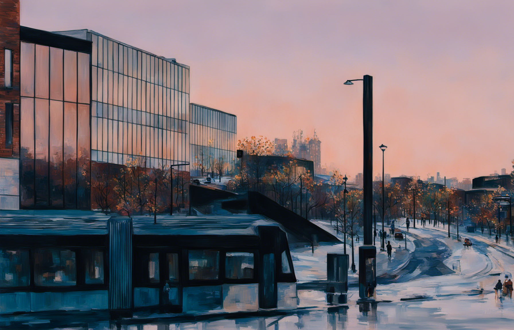

# Deep Generative Models for Style Transfer

Exploring state-of-the-art deep generative models (DGMs) for creating Impressionist-style paintings.





## Installation

### Environment
Create conda environment:

```shell
conda env create -f environment.yml
```

### Model

Download the pretrained model weights and place them in the `MODEL_NAME/checkpoints` directory.
e.g.
```shell
cd Stable-Diffusion/checkpoints
wget https://huggingface.co/stabilityai/stable-diffusion-xl-base-1.0/resolve/main/sd_xl_base_1.0.safetensors
```

#### Stable Diffusion

**SDXL-1.0**:

- [base model](https://huggingface.co/stabilityai/stable-diffusion-xl-base-1.0/)
- [refiner model](https://huggingface.co/stabilityai/stable-diffusion-xl-refiner-1.0/)


#### Guided Diffusion

- [diffusion](https://aaltofi-my.sharepoint.com/:f:/g/personal/xinyi_wen_aalto_fi/EnGSIn8ytKBNoJxAsb578vwB1XvhWvrfUcA8GrET4maezQ?e=CoKoBv)

## Run
Open Jupyter Notebook and run all cells:

- [SDXL](Stable-Diffusion/SDXL.ipynb)
- [Guided Diffusion](CLIP-Guided/Guided-Diffusion.ipynb)

Config params in `Run->Test`.


## Acknowledgement
Codebase from [Generative Models by Stability AI](https://github.com/Stability-AI/generative-models), [Guided Diffusion](https://github.com/openai/guided-diffusion).